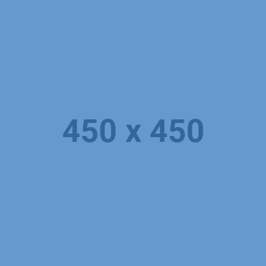
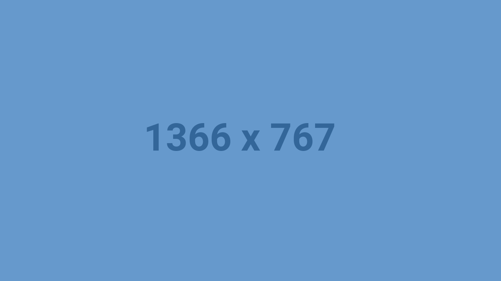

<h1 align="center"> ⚡️ DevFolio ⚡️</h1>

[](https://github.com/AnilSeervi/DevFolio/blob/master/README.md)  

## A minimal portfolio template for Developers!

## Features

⚡️ Modern UI Design + Reveal Animations + Hover Effects\
⚡️ One Page Layout\
⚡️ Custom SCSS\
⚡️ Fully Responsive\
⚡️ Valid HTML5 & CSS3\
⚡️ Well organized documentation

To view a demo example, **[Click Here](https://anilseervi.github.io/DevFolio/)**\
To view a live example, **[Click Here](https://anilseervi.github.io/Portfolio/)**\
To view live example repo, **[Click Here](https://github.com/AnilSeervi/Portfolio/)**

## Getting Started 🚀

Here's a **Complete Guide** to walk you through the process of setting your own Portfolio Website with this minimal template on your local machine as well as hosting it on GitHub.

### Prerequisites 📋

You'll need [VSCode](https://code.visualstudio.com/) and [Git](https://git-scm.com/) installed on your computer.

You'll also need these two extensions [Live Server](https://marketplace.visualstudio.com/items?itemName=ritwickdey.LiveServer) and [Live Sass Compiler](https://marketplace.visualstudio.com/items?itemName=ritwickdey.live-sass) installed in your VSCode.

Press F1 and Search for _Open Settings(JSON)_ and paste the below code before the closing braces( } ).

```json
"liveSassCompile.settings.generateMap": false,
"liveSassCompile.settings.formats": [
    {
      "format": "compressed",
      "savePath": "/css",
      "extensionName": ".css"
    }
  ],
"liveSassCompile.settings.excludeList": ["**/node_modules/**", ".vscode/**"],

```

---

## How To Use 🔧

In VSCode, Open the terminal( Ctrl+` ) and clone the DevFolio Repo.

```bash
# Clone this repository
$ git clone https://github.com/AnilSeervi/DevFolio.git

# Go into the repository
$ cd DevFolio

# Remove current origin repository
$ git remote remove origin
```

Now Simply click on **Watch Sass** and **Go Live** in the Status Bar.

<h3 align="center">
OR
</h3>
Press *Ctrl+Shift+P* or *F1* to Show Command Palette, Search for **Watch Sass** and turn it on. Also search for **Open With Live Server** and turn it on. Doing this will watch all your Sass files for changes and will open the website in your browser to preview live.

---

## Template Instructions

### Step 1 - STRUCTURE

Open `index.html` and fill your information, they are 5 sections:

### Hero Section

- On `.hero-title`, put your custom title.
- On `.hero-cta`, put your custom button cta.

```html
<!-- Hero Section -->
<div id="hero">
  <section class="container">
    <h1 class="hero-title">
      Hi, my name is <span class="text-color-main name">Your Name</span>
      <br />
      I'm the Unknown Developer.
    </h1>
    <p class="hero-cta">
      <a class="cta-btn cta-btn--hero" href="#about">Get in touch</a>
    </p>
  </section>
  <a href="#about" class="scroll-down-link"> <div class="scroll-down"></div></a>
</div>
<!-- /END Hero Section -->
```

### About Section

- On `` tag, fill the `src` attribute with your profile picture, your picture must be located inside `assets/` folder.
  - Recommended size for your profile image is (450 x 450px).
- On `<p>` tag with class-name `.about-wrapper__info-text`, include information about you, I recommend to use 2 paragraphs in order to work well and a maximum of 3 paragraphs.
- On last `<a>` tag, include your resume url on `href` attribute.

```html
<!-- About Section -->
<section id="about">
  <div class="container">
    <h2 class="section-title">About Me</h2>
    <div class="row about-wrapper">
      <div class="about-wrapper__image">
        
      </div>
      <div class="about-wrapper__info">
        <p class="about-wrapper__info-text">
          Lorem ipsum dolor sit amet consectetur adipisicing elit.
        </p>
        <p class="about-wrapper__info-text">
          Lorem ipsum dolor sit amet consectetur adipisicing elit.
        </p>
        <span class="about-wrapper__cta">
          <a href="#" class="cta-btn cta-btn--resume">View Resume</a>
        </span>
      </div>
    </div>
  </div>
</section>
<!-- /END About Section -->
```

### Projects Section

- Each project lives inside `row` class.
- On `<h3>` tag with class-name `.project-wrapper__text-title`, include your project title.
- On `<p>` tag with `loremp ipsum` text, include your project information.
- On first `<a>` tag, put your project url on `href` attribute.
- On second `<a>` tag, put your project repository url on `href` attribute.

---

- Inside `<div>` tag with class-name `.project-wrapper__image`, put your project image url on the `src` of the `` and put again your project url on `href` attribute of `<a>` tag.
- Recommended size for project image (1366 x 767px), your project image must live on `assets/` folder.

```html
<!--Projects Section-->
    <section id="projects">
      <div class="container">
        <div class="project-wrapper">
          <h2 class="section-title dark-blue-text">Projects</h2>

        <!-- Each .row is a project -->
          <div class="row">
            <div class="project-wrapper__text">
              <h3 class="project-wrapper__text-title">Project Title</h3>
              <p class="project-wrapper__text-info">
                Lorem ipsum dolor sit amet consectetur adipisicing elit.
              </p>
              <div class="project-wrapper__text-btns">
                <a
                  href="#"
                  target="_blank"
                  class="cta-btn cta-btn--hero cta-btn--projects"
                  >See Live</a
                >
                <a href="#" target="_blank" class="cta-btn text-color-main"
                  >Source Code</a
                >
              </div>
            </div>

            <div class="project-wrapper__image">
              <a href="#" target="_blank">
                <div class="thumbnail rounded">
                  
                </div>
              </a>
            </div>
          </div>
          ...
          </section>
<!-- /END Project -->
```

### Contact Section

- On `<p>` tag with class-name `.contact-wrapper__text`, include some custom call-to-action message.
- On `<a>` tag, put your email address on `href="mailto:` attribute.

```html
<!-- Contact Section -->
<section id="contact">
  <div class="container">
    <h2 class="section-title">Contact</h2>
    <div class="contact-wrapper">
      <p class="contact-wrapper__text">[Put your call to action here]</p>
      <a href="mailto:" class="cta-btn cta-btn--resume">Call to Action</a>
    </div>
  </div>
</section>
<!-- END Contact Section -->
```

### Footer Section

- Put your social media link on each `<a>` links.
- If you have more social-media accounts, see [Font Awesome Icons](https://fontawesome.com/v4.7.0/icons/) to put the corresponding additional social icon classNames.
- You can delete or add as many `a` links your want.

```html
<!-- Footer Section -->
<footer class="footer">
  ...
  <div class="social-links">
    <a href="#!" target="_blank">
      <i class="fa fa-twitter"></i>
    </a>
    <a href="#!" target="_blank">
      <i class="fa fa-instagram"></i>
    </a>
    <a href="#!" target="_blank">
      <i class="fa fa-codepen"></i>
    </a>
    <a href="#!" target="_blank">
      <i class="fa fa-linkedin"></i>
    </a>
    <a href="#!" target="_blank">
      <i class="fa fa-github"></i>
    </a>
  </div>
  ...
</footer>
<!-- END Footer Section -->
```

### Step 2 - STYLES

Change the color theme of the website ( choose 2 colors to create a gradient ):

Go to `style/base/_variables.scss` and only change the values on these properties `$main-color` and `$secondary-color` to your prefered HEX color.

Save the `.scss` file so that the Live Sass Compiler extension compiles it to `.css`.

```scss
// Default values
$primary-color: #36d1dc;
$secondary-color: #5b86e5;
```

**NOTE**: I highly recommend to checkout gradients variations on [UI Gradient](https://uigradients.com/#Scooter)

---
